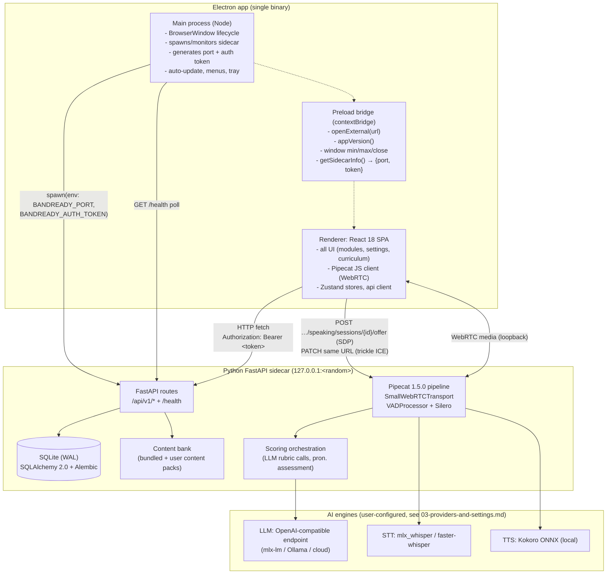

# 01 — System architecture

> **Design intent as of 2026-07-25 — not a description of what exists.** This is a planning document, written before implementation began. Much of it shipped differently. For what actually ships, read [CONTRIBUTING.md §2](../../CONTRIBUTING.md#2-repository-map) and [REPOSITORY.md](../REPOSITORY.md). Where this doc and the code disagree, the code is right.
>
> Kept because the reasoning behind each decision is not recorded anywhere else, and the `R2-*` rulings in [_context/decisions.md](_context/decisions.md) are cited from code comments.

_Status: draft v2 (2026-07-25)_

BandReady is a three-process desktop app: an **Electron main process** that owns windows, app lifecycle, and the sidecar; a **React 18 SPA renderer** (Vite + TypeScript + Tailwind) that owns all UI; and a **Python FastAPI sidecar** that owns everything stateful and AI-shaped — the Pipecat 1.5.0 voice pipeline, SQLite, the content bank, and scoring orchestration. The renderer talks to the sidecar over loopback HTTP (bearer-token authenticated) and WebRTC, exactly as OpenVoiceUI's SPA talks to its server — which is the whole point: the proven LiveCall/WebRTC/design-system code transfers nearly verbatim. This doc records ADR-001 (Electron over React Native) and ADR-002 (Python sidecar over Node backend), and specifies the sidecar lifecycle, the security contract between processes, the repo layout, per-OS data directories, and the dev-mode workflow. Bundling of the Python runtime is owned by 13-packaging-distribution.md.

## 1. System overview



Three hard boundaries:

1. **Renderer ↔ main**: only the preload bridge (`contextIsolation: true`, `nodeIntegration: false`). The renderer has zero Node access.
2. **Renderer ↔ sidecar**: HTTP + WebRTC over `127.0.0.1` only, every HTTP request bearer-authenticated. This is the *primary* data path — the renderer never asks main for data, only for OS integration.
3. **Sidecar ↔ engines**: sidecar makes outbound calls to whatever LLM/STT/TTS the user configured (local server or cloud). The renderer never talks to AI providers directly; API keys live only in the sidecar's encrypted store.

## 2. ADR-001 — Electron, not React Native desktop

**Status: accepted (locked in `_context/decisions.md`).**

### Context

We need one codebase shipping to macOS and Windows (Linux welcome but not release-blocking), with first-class real-time voice: browser-grade WebRTC, mic capture, echo cancellation, and the Pipecat JS client SDK (`@pipecat-ai/client-js` + `@pipecat-ai/small-webrtc-transport`). We also hold a large proven asset: OpenVoiceUI's React 18 + Tailwind UI — the LiveCall page, the token-based design system, the UI kit (Button/Card/Modal/Drawer/…), the Zustand patterns.

### Options considered

| | Electron | react-native-macos + react-native-windows | Tauri (considered briefly) |
|---|---|---|---|
| Pipecat web SDK | Works as-is (it's a browser SDK) | **No viable path** — RN has no DOM, no `navigator.mediaDevices`; the SDK would need a ground-up native rewrite | Works (system WebView) but WebRTC/WebView quality varies by OS WebView version |
| WebRTC | Chromium's, best-in-class, identical on every OS | `react-native-webrtc` exists but macOS/windows forks are weakly maintained; no `SmallWebRTCTransport` equivalent | WebView-dependent (WKWebView/WebView2); getUserMedia quirks on macOS WKWebView |
| Tailwind design-system reuse | 100% — same CSS, same tokens | 0% — RN styling is a different system (StyleSheet/NativeWind approximations) | 100% |
| OpenVoiceUI UI-kit reuse | ~100% (Headless UI, lucide, Zustand all DOM) | ~0% | ~100% |
| Memory footprint | **Worst**: ~250–400 MB baseline (Chromium + Node + our Python sidecar on top) | **Best**: native views, roughly 100–200 MB lighter | Good: no bundled Chromium |
| Binary size | ~120–200 MB before Python | Small | Smallest |
| Windows + macOS parity | One team ships both | Two half-communities; `react-native-windows` and `react-native-macos` lag RN core versions independently | Good |
| Ecosystem/tooling maturity for this shape of app | Very high (VS Code, Slack, Obsidian) | Low for desktop | Medium; Rust main process means our sidecar-management code is new ground in an unfamiliar language |

### Decision

**Electron.** The honest cost is memory and disk: an Electron app with a bundled Python runtime will idle around 400–600 MB RSS, where an RN-desktop app might sit 150–250 MB lighter. We accept that because:

1. **The Pipecat JS SDK is the deciding factor.** BandReady's core loop is live voice. On RN desktop there is no path to `SmallWebRTCTransport`, `PipecatClientAudio`, `usePipecatConversation`, or the `initDevices()` flow — we would re-implement WebRTC signaling, mic pipeline, and audio playback natively, twice (macOS + Windows). That alone is months of risk on the least-forgiving part of the stack.
2. **The five Pipecat gotchas (see 02-voice-pipeline.md) were paid for in Chromium.** OpenVoiceUI's working config is verified against Chromium's WebRTC stack. Changing the client stack invalidates that verification.
3. **Total reuse of OpenVoiceUI's front end**: Tailwind token system, Inter typography, UI kit, LiveCall patterns, Zustand conventions. RN discards all of it.
4. Electron gives Linux support essentially free.

Mitigations for the footprint: single `BrowserWindow`, no extra renderer processes, `backgroundThrottling` left on for hidden windows, sidecar loads STT/TTS models lazily (first speaking session, not boot), and 13-packaging-distribution.md tracks install size budget.

### Consequences

- Renderer code is plain web code — testable in a normal browser against the sidecar (see 14-testing-strategy.md).
- We must own Electron security hardening ourselves (section 5).
- Auto-update via `electron-updater` (default choice; 13-packaging-distribution.md owns it).

## 3. ADR-002 — Python FastAPI sidecar, not a Node backend

**Status: accepted (locked in `_context/decisions.md`).**

### Context

Electron's main process is already a Node runtime; the "obvious" move is to put the backend there. But the AI stack is not neutral on language:

- **pipecat-ai 1.5.0** — Python-only. There is no Node port of the pipeline, `SmallWebRTCTransport` server side, `SileroVADAnalyzer`, or the aggregator/turn-strategy machinery.
- **faster-whisper** (CTranslate2) — Python-only bindings.
- **mlx-lm / mlx_whisper** — Python-only (Apple MLX).
- **kokoro-onnx** — Python package.
- SQLAlchemy 2.0 + Alembic migration discipline is proven in OpenVoiceUI.

A Node backend would reduce us to cloud-only providers and a hand-rolled voice pipeline — abandoning the entire verified OpenVoiceUI voice stack.

### Decision

Ship a **Python 3.11+ FastAPI sidecar** as a child process of Electron main. It is a self-contained runtime (PyInstaller one-dir or python-build-standalone + bundled venv — 13-packaging-distribution.md decides), owning:

- Pipecat voice pipeline + WebRTC signaling (02-voice-pipeline.md)
- SQLite + migrations (11-data-model.md)
- Content bank loading/validation (15-content-authoring-licensing.md)
- Scoring orchestration: rubric prompts to the LLM, pronunciation assessment (04/05/09)
- Provider config, lockfile, secret storage (03-providers-and-settings.md)

Electron main owns *only*: windows, menus, tray, auto-update, OS integration, and the sidecar's lifecycle. It contains **no business logic** — this keeps the "could later run the sidecar remotely / headless-test it" doors open.

### Consequences

- Two runtimes shipped (Chromium+Node, Python). Install size and packaging complexity go up; 13-packaging-distribution.md pays that bill.
- Crash isolation: a Pipecat/native-lib crash kills the sidecar, not the window. Main restarts it (section 4.4) and the renderer shows a reconnect state instead of a dead app.
- Same `workers=1` contract as OpenVoiceUI: WebRTC/session state is in-process, so exactly one uvicorn worker, one sidecar process, ever.

## 4. Sidecar lifecycle

### 4.1 Spawn

On `app.whenReady()`, before creating the window:

```ts
// app/electron/sidecar.ts (main process)
import { randomBytes } from "node:crypto";
import { spawn } from "node:child_process";
import net from "node:net";

async function pickPort(): Promise<number> {
  // Ask the OS for a free ephemeral port, then release it and hand it to the sidecar.
  return new Promise((resolve, reject) => {
    const srv = net.createServer();
    srv.listen(0, "127.0.0.1", () => {
      const { port } = srv.address() as net.AddressInfo;
      srv.close(() => resolve(port));
    });
    srv.on("error", reject);
  });
}

export async function startSidecar(dataDir: string) {
  const port = await pickPort();
  const token = randomBytes(32).toString("hex"); // one-time, per app launch
  const child = spawn(sidecarBinaryPath(), ["serve"], {
    env: {
      ...minimalEnv(), // PATH, HOME/USERPROFILE, TMPDIR only — no inherited secrets
      BANDREADY_HOST: "127.0.0.1",
      BANDREADY_PORT: String(port),
      BANDREADY_AUTH_TOKEN: token,
      BANDREADY_DATA_DIR: dataDir,
      BANDREADY_LOG_LEVEL: isDev ? "debug" : "info",
    },
    stdio: ["ignore", "pipe", "pipe"], // stdout/stderr → rotating log file in dataDir/logs
  });
  return { child, port, token };
}
```

Rules (some inherited from OpenVoiceUI lessons):

- **Bind host is explicit** — `BANDREADY_HOST=127.0.0.1` is read by the sidecar CLI and passed to uvicorn directly. OpenVoiceUI's argparse-ignores-env bug must not recur: env is the *only* source of host/port in packaged mode; argparse flags exist for dev only and defaults are `127.0.0.1`.
- **Token via env, never argv** (argv is visible in `ps`). The sidecar reads `BANDREADY_AUTH_TOKEN` at startup and holds it in memory only.
- The port-pick has a small TOCTOU race (port freed, then rebound). If the sidecar fails to bind (`EADDRINUSE` detected in its stderr / exit code 2), main simply picks a new port and respawns — bounded to 3 attempts.

### 4.2 Health check

- Sidecar exposes `GET /health` → `200 {"status":"ok","version":"<semver>","db":"ok","migrations":"<head-rev>"}`. This is the **only unauthenticated route**.
- Main polls every 250 ms, timeout 15 s (cold start with migrations can take a few seconds; model loading is deliberately *not* part of boot). On success it creates the `BrowserWindow`; on timeout it shows a native error dialog with a "show log" button pointing at `dataDir/logs/sidecar.log`.
- A splash/loading state in the renderer is unnecessary — the window simply isn't shown until the sidecar is healthy (default; revisit if boot exceeds ~3 s in practice).

### 4.3 Handing the contract to the renderer

The renderer discovers the sidecar via the preload bridge, not via hardcoded ports:

```ts
// app/electron/preload.ts
import { contextBridge, ipcRenderer } from "electron";
contextBridge.exposeInMainWorld("bandready", {
  getSidecarInfo: (): Promise<{ baseUrl: string; token: string }> =>
    ipcRenderer.invoke("sidecar:info"),          // → { baseUrl: "http://127.0.0.1:PORT", token }
  openExternal: (url: string) => ipcRenderer.invoke("shell:openExternal", url), // https? URLs only, validated in main
  appVersion: (): Promise<string> => ipcRenderer.invoke("app:version"),
  windowControl: (op: "minimize" | "maximize" | "close") =>
    ipcRenderer.invoke("window:control", op),
});
```

The SPA's api client wraps every call:

```ts
// app/src/lib/api.ts — same single-wrapper pattern as OpenVoiceUI's req<T>()
const { baseUrl, token } = await window.bandready.getSidecarInfo(); // cached at boot
async function req<T>(path: string, init: RequestInit = {}): Promise<T> {
  const res = await fetch(`${baseUrl}/api/v1${path}`, {
    ...init,
    headers: { Authorization: `Bearer ${token}`, "Content-Type": "application/json", ...init.headers },
  });
  if (!res.ok) throw new ApiError(res.status, await safeDetail(res));
  return res.json();
}
```

### 4.4 Crash restart with backoff

On `child.on("exit")` when the app isn't quitting:

- Restart with exponential backoff: 0.5 s → 1 s → 2 s → 4 s → 8 s (cap), counter reset after 60 s of healthy uptime.
- Each restart generates a **new port and token**; main pushes the new contract to the renderer via `webContents.send("sidecar:changed", info)` and the api client re-reads it. In-flight speaking sessions are lost (WebRTC state is in-process) — the renderer shows "Session interrupted — reconnecting…" and returns the user to the module screen.
- After **5 consecutive failures** (no healthy period between), stop retrying and show the fatal dialog with the log path.
- Sidecar also self-defends: if its parent dies (detected by `BANDREADY_PARENT_PID` no longer existing, checked every 5 s), it exits — no orphaned Python processes after an Electron hard-crash.

### 4.5 Graceful shutdown

On `app.before-quit`:

1. Main sends `POST /internal/shutdown` (bearer-authed); sidecar cancels active `PipelineTask`s (`task.cancel()` — writes session logs in its finally-blocks, same as OpenVoiceUI's hangup path), checkpoints SQLite WAL, then exits 0.
2. Main waits up to 5 s; then `SIGTERM`; after 3 more s, `SIGKILL` (`taskkill /T /F` on Windows).
3. Quit proceeds only after the child has exited.

## 5. Security model (renderer → sidecar, renderer sandboxing)

Single-user local-first app (per decisions.md: no accounts, no RBAC) — but the sidecar is still a real HTTP server on localhost, so it must be unusable by other local processes and by any web page doing DNS-rebinding/CSRF tricks.

| Layer | Control |
|---|---|
| Network | Sidecar binds `127.0.0.1` only. Never `0.0.0.0`. |
| AuthN | Every route except `/health` requires `Authorization: Bearer <token>`; token is 256-bit random, per-launch, delivered via env → preload IPC. Constant-time compare. 401 on failure, no detail. |
| Media & WebSocket auth | `<audio>` elements and browser `WebSocket` cannot set headers, so those two contexts use **short-lived signed tickets** (R2-2): renderer calls `POST /api/v1/tickets` (bearer) → `{ticket, expires_in: 60}`, then appends `?ticket=` to the media/WS URL. Tickets are single-audience (`media-read` or `session-events`), HMAC-signed with the sidecar token, TTL 60 s, and never logged (access-log middleware redacts the query param). Full spec: 18-api-contract.md §2. |
| CSRF / rebinding | FastAPI middleware rejects requests whose `Host` header isn't `127.0.0.1:<port>` and whose `Origin` (when present) isn't the app origin (`http://localhost:5173` in dev, `file://`/`app://` absent-Origin in prod). Belt-and-braces on top of the bearer token. |
| CORS | Not enabled in production (same-token requests come from the Electron renderer via fetch with explicit header; no cross-origin allowance needed). Dev-mode allows the Vite origin. |
| Electron BrowserWindow | `contextIsolation: true`, `nodeIntegration: false`, `sandbox: true`, `webSecurity: true`, `webviewTag` disabled, `will-navigate` and `setWindowOpenHandler` deny all external navigation (external links go through `openExternal`, main validates `https:` scheme). |
| Preload surface | Exactly the four methods in section 4.3. No generic `ipcRenderer` exposure, no `send/on` passthrough. |
| Secrets | Provider API keys stored encrypted at rest by the sidecar (reuse OpenVoiceUI `security/secrets.py` pattern: per-install key file, 0600, in the data dir). Keys never transit to the renderer — settings API returns masked values (`sk-…abcd`). |
| CSP | Renderer `Content-Security-Policy`: `default-src 'self'; connect-src 'self' http://127.0.0.1:*; media-src 'self' blob: http://127.0.0.1:*; img-src 'self' data: blob:; style-src 'self' 'unsafe-inline'` (`media-src` includes loopback so `<audio>` elements can stream ticket-authenticated sidecar media, 18 §4.16; Tailwind runtime theming injects a `<style>` tag — values validated against strict HSL regex, same as OpenVoiceUI). |

WebRTC media is DTLS-SRTP encrypted by construction and both peers are on loopback; the signaling endpoints (`/offer`) are bearer-protected like everything else.

## 6. WebRTC signaling path

Identical shape to OpenVoiceUI (verified working, do not innovate here). Route shapes below are the canonical `/api/v1` forms from 18-api-contract.md (R2-1) — this section illustrates the handshake; 18 owns the inventory:

1. Session start/config (which module, which question card, examiner persona) comes first: `POST /api/v1/speaking/sessions` → `201 {session_id, offer_url, events_url}`, so the pipeline is assembled per-session (04-speaking-module.md owns the session model).
2. Renderer: `new SmallWebRTCTransport({ webrtcRequestParams: { endpoint: `${baseUrl}/api/v1/speaking/sessions/${sessionId}/offer`, headers: { Authorization: `Bearer ${token}` } } })` → `new PipecatClient({ transport, enableMic: true, enableCam: false })`.
3. **`await client.initDevices()` BEFORE `await client.connect()`** — gotcha #3; mic is never published otherwise.
4. `POST /api/v1/speaking/sessions/{session_id}/offer` carries the SDP offer; sidecar's module-level `SmallWebRTCRequestHandler(ice_servers=[])` answers. Empty ICE servers is correct: both peers are on 127.0.0.1, no STUN/TURN needed.
5. **Trickle ICE arrives as `PATCH` to the same offer URL** → `handle_patch_request`, accepting both snake_case and camelCase keys — gotcha #4.
6. Pipeline assembly, VADProcessor placement, turn-stop strategy, and VAD params follow 02-voice-pipeline.md to the letter (gotchas #1, #2, #5).

(The earlier `POST /api/v1/voice/offer` + separate `POST /api/v1/sessions` sketch in this doc is superseded by the session-scoped offer URL above — C2/R2-1.)

## 7. Repository layout (BINDING — R2-9)

Monorepo, **pnpm** for all JS (one package manager — OpenVoiceUI's npm/pnpm mix was a mistake), **uv** for Python.

**This tree is binding (ruling R2-9, resolving C3).** The divergent sketches elsewhere — `packages/core/bandready/…` (02 §1, 09 §4.0), `apps/desktop`/`apps/renderer` (16 P0), `webui/src/…` (06/07) — are corrected to this layout. Frontend feature code lives under `app/src/features/<module>/` (the earlier `src/pages/…` naming is superseded).

```
bandready/
├── app/                          # Electron + React (one pnpm package)
│   ├── electron/
│   │   ├── main.ts               # app lifecycle, window creation
│   │   ├── sidecar.ts            # spawn/health/restart/shutdown (section 4)
│   │   ├── preload.ts            # contextBridge surface (section 4.3)
│   │   ├── ipc.ts                # ipcMain handlers (sidecar:info, shell:openExternal, …)
│   │   └── update.ts             # electron-updater wiring
│   ├── src/                      # React SPA (structure mirrors OpenVoiceUI webui)
│   │   ├── main.tsx              # bootstrapTheme().finally(mount) — no theme flash
│   │   ├── App.tsx               # router + PageShell
│   │   ├── lib/api.ts            # req<T>() wrapper, ApiError
│   │   ├── stores/               # the four GLOBAL Zustand stores: session, settings, progress, srs (R2-23)
│   │   ├── components/ui/        # ported OpenVoiceUI kit (12-design-system.md)
│   │   ├── components/shell/     # PageShell, Sidebar, window chrome
│   │   ├── features/             # one folder per module: page + components + ephemeral store.ts
│   │   │   ├── speaking/         # LiveCall-derived session UI (04)
│   │   │   ├── writing/          # (05)
│   │   │   ├── reading/          # (06)
│   │   │   ├── listening/        # (07)
│   │   │   ├── vocab/            # SRS (08)
│   │   │   ├── curriculum/       # placement, plan, progress (10)
│   │   │   └── settings/         # config_spec-driven form (03)
│   │   └── styles/tokens.css     # HSL token variables (12)
│   ├── index.html
│   ├── vite.config.ts            # @ → src alias; dev proxy NOT used (renderer hits sidecar directly with token)
│   ├── electron-builder.yml      # see 13-packaging-distribution.md
│   ├── package.json
│   └── tsconfig.json
├── sidecar/                      # Python package: `bandready-sidecar`
│   ├── pyproject.toml            # hatchling, requires-python >=3.11, pipecat-ai==1.5.0 PINNED
│   ├── bandready/
│   │   ├── cli.py                # `bandready-sidecar serve` — env-first host/port (section 4.1)
│   │   ├── server/
│   │   │   ├── app.py            # create_app(): migrations → seed content → provider init
│   │   │   ├── auth.py           # bearer middleware + host/origin guard (section 5)
│   │   │   └── routes/           # one router per 18-api-contract.md family: speaking (sessions/offer/events WS),
│   │   │                         #   writing, reading, listening, vocab, srs, pron, progress, settings, providers,
│   │   │                         #   tickets, jobs, dictionary, media, packs, models (18 owns the inventory)
│   │   ├── voice/                # pipeline.py, runtime.py, transcript.py, injector.py (02)
│   │   ├── providers/            # OpenAI-compat adapter, local engines, config_spec (03)
│   │   ├── scoring/              # rubric orchestration, shared round_ielts() (R2-4), pronunciation (04/05/09)
│   │   │                         #   answers.py = THE shared answer normalizer, imported by reading AND
│   │   │                         #   listening (R2-9; variant-aware article rule per 07)
│   │   ├── srs/                  # scheduler (08)
│   │   ├── content/              # pack loader + validator (15)
│   │   ├── db/                   # engine.py (WAL, foreign_keys, busy_timeout), models.py (11)
│   │   ├── migrations/           # Alembic
│   │   └── security/             # secrets.py (encrypted-at-rest keys)
│   └── tests/
├── content/                      # original content packs, JSON + audio (15)
│   ├── core-en/                  # shipped default pack
│   └── schema/                   # JSON Schema for pack validation
├── docs/
│   └── plan/                     # these documents
├── tools/
│   └── content/                  # content authoring/validation CLI (15); also published to PyPI as
│                                 #   `bandready-content`, a thin re-export of bandready.content validators (R2-8)
├── scripts/
│   └── dev.mjs                   # orchestrates dev mode (section 10)
├── .github/workflows/            # CI (14-testing-strategy.md)
├── package.json                  # pnpm workspace root
└── pnpm-workspace.yaml
```

Wheel/bundle lesson applied: any static assets the sidecar serves are resolved via `Path(__file__).parent` and force-included in the build — never resolved relative to a source tree that won't exist when packaged. (In BandReady the SPA is loaded by Electron from disk, *not* served by the sidecar, so this mainly applies to bundled model/content defaults.)

### 7.1 Frontend state convention (R2-23)

Exactly **four global Zustand stores** live in `app/src/stores/`:

- `session` — sidecar contract (`baseUrl`/token, reconnect state) + the live speaking-session mirror (WS events);
- `settings` — settings document cache + theme;
- `progress` — band estimates, plan, streak (dashboard reads);
- `srs` — due counts + review-queue chunk.

Everything else is a **per-feature ephemeral store** at `app/src/features/<module>/store.ts` (e.g. the writing editor draft, reading answers/highlights/timer, listening player state, vocab browse filters), created for the feature's lifetime and reset when the learner leaves it. **Attempt-in-progress state is feature-local, never global** — durability is the sidecar's job via the autosave `PATCH` routes (18-api-contract.md), not a global store's. Adding a fifth global store is a doc change here, not a code-review nit.

## 8. Data directory layout

Root per OS (main passes it as `BANDREADY_DATA_DIR`; the sidecar never computes it itself, so both processes always agree):

| OS | Path |
|---|---|
| macOS | `~/Library/Application Support/BandReady` |
| Windows | `%APPDATA%\BandReady` |
| Linux | `$XDG_DATA_HOME/BandReady` (default `~/.local/share/BandReady`) |

The tree below conforms to **11-data-model.md §9, which is canonical (R2-18)** — this doc's earlier `recordings/` and `content/` entries are superseded by `media/speaking/…` and `packs/…`:

```
BandReady/
├── bandready.db                # SQLite (+ -wal, -shm)
├── secret.key                  # per-install encryption key, 0600 (sidecar-created)
├── settings.json               # provider lockfile: shipped defaults ⊕ user overrides,
│                               #   atomic writes (mkstemp→fsync→replace), ${ENV} interpolation,
│                               #   corrupt file quarantined to settings.json.corrupt-<ts>  (03)
├── models/                     # downloaded local model weights
│   ├── whisper/                # faster-whisper / mlx_whisper models
│   ├── kokoro/                 # kokoro onnx + voices
│   └── pron/                   # on-demand GOP pronunciation model (09)
├── media/                      # all audio — user recordings + hash-addressed caches (11 §9)
│   ├── speaking/<session_id>/  # user turn recordings + manifest.json (02 §5) — NEVER auto-evicted
│   ├── pron/
│   │   ├── ref/<voice_id>/     # Kokoro reference-audio cache (09 §5.2) — evictable
│   │   └── attempts/           # read-aloud/shadowing/minimal-pair user recordings — NEVER auto-evicted
│   ├── vocab/<entry_id>.wav    # Kokoro headword audio (08 §5.3) — evictable, regenerated on miss
│   ├── listening/<hash>.wav    # rendered part audio + <hash>.timing.json (07 §3) — evictable
│   └── tts-lines/<hash>.wav    # per-line TTS cache — evictable
├── packs/<pack_id>/<version>/  # extracted user-installed content packs, read-only, pinned
│                               #   (shipped default pack stays inside the app bundle)
├── exports/                    # user-triggered data exports
└── logs/
    ├── sidecar.log             # rotating, 5 × 5 MB
    └── main.log
```

Retention follows 11 §9's canonical policy: **user recordings are never auto-evicted** (deleted only with an explicit session/recording delete — the old "20-session pruning" language is repealed per R2-6); generated/cache audio is LRU-evicted against the `media.cache_budget_mb` budget (default 2 GB); pack media is pinned until pack uninstall.

Electron's own `userData` (cookies, cache) stays at Electron's default location; the directory above is exclusively BandReady domain data, which makes "export/backup my data" a single-folder story.

## 9. Process / port / env contract

| Item | Value | Set by | Read by |
|---|---|---|---|
| Sidecar bind host | `127.0.0.1`, always | main (`BANDREADY_HOST`) | sidecar CLI → uvicorn |
| Sidecar port | random free ephemeral port per launch | main (`BANDREADY_PORT`) | sidecar; renderer via `getSidecarInfo()` |
| Auth token | 64-hex-char (256-bit), per launch, rotates on restart | main (`BANDREADY_AUTH_TOKEN`) | sidecar middleware; renderer via `getSidecarInfo()` |
| Data dir | per-OS path (section 8) | main (`BANDREADY_DATA_DIR`) | sidecar |
| Parent PID | Electron main PID (orphan watchdog) | main (`BANDREADY_PARENT_PID`) | sidecar |
| Log level | `info` prod / `debug` dev | main (`BANDREADY_LOG_LEVEL`) | sidecar |
| Uvicorn workers | `1` — hard contract, WebRTC + session state is in-process | sidecar CLI (not configurable) | — |
| Unauthenticated routes | `GET /health` only | — | — |
| API prefix | `/api/v1` (unknown `/api/*` → 404 JSON, never HTML). The complete route inventory is owned by 18-api-contract.md (R2-1) — module docs, this one included, reference it instead of inventing routes | — | — |
| Renderer page origin | `app://` custom protocol serving `app/dist` (default; `file://` fallback) | main | — |
| Health poll | 250 ms interval, 15 s budget | main | — |
| Restart policy | backoff 0.5→8 s, reset after 60 s healthy, fatal after 5 straight failures | main | — |
| Shutdown | `POST /internal/shutdown` → 5 s → SIGTERM → 3 s → SIGKILL | main | sidecar |

## 10. Dev mode

`pnpm dev` at repo root runs `scripts/dev.mjs`, which starts three processes:

```
┌ vite dev server ── http://localhost:5173 (HMR for the SPA)
├ uvicorn --reload ─ http://127.0.0.1:8710 (fixed dev port, fixed dev token)
└ electron ──────── loads http://localhost:5173 instead of app://
```

1. **Sidecar**: `uv run uvicorn bandready.server.app:app --reload --host 127.0.0.1 --port 8710` with `BANDREADY_AUTH_TOKEN=dev-token BANDREADY_DATA_DIR=./.dev-data`. Fixed port + token in dev so the SPA can also be opened in a plain browser (fastest loop for UI work, mirrors OpenVoiceUI development).
2. **Vite**: standard dev server. No `/api` proxy needed — the api client targets the sidecar's absolute base URL with the bearer header; dev-mode CORS on the sidecar allows `http://localhost:5173`.
3. **Electron**: `ELECTRON_RENDERER_URL=http://localhost:5173` makes main `loadURL` the Vite server; main still spawns nothing (it detects the already-running dev sidecar via `BANDREADY_DEV_SIDECAR=http://127.0.0.1:8710`) — or, when testing lifecycle code itself, `pnpm dev --spawn-sidecar` exercises the real spawn path.
4. In dev, `getSidecarInfo()` returns the fixed dev contract; when the page is opened in a raw browser (no preload), the api client falls back to `import.meta.env.VITE_SIDECAR_URL` + `VITE_SIDECAR_TOKEN`.

Electron main/preload TS is compiled by `electron-vite` (default choice) so main-process changes hot-restart too.

## 11. Cross-references

- 02-voice-pipeline.md — pipeline assembly, the five gotchas, VAD/turn params
- 03-providers-and-settings.md — one-LLM/one-STT/one-TTS settings, lockfile, engine detection
- 11-data-model.md — SQLite schema behind section 8's database; §9 owns the canonical media tree + eviction policy
- 18-api-contract.md — authoritative `/api/v1` route inventory, ticket auth (R2-2), job convention (R2-3)
- 12-design-system.md — token palette and UI kit ported from OpenVoiceUI
- 13-packaging-distribution.md — Python runtime bundling, code signing, auto-update, size budget
- 14-testing-strategy.md — browser-mode SPA testing, headless voice E2E harness reuse

## Open questions

1. **Custom `app://` protocol vs `file://` for the packaged renderer** — `app://` (via `protocol.handle`) gives a real origin for CSP and avoids `file://` fetch quirks, but adds code; default above is `app://`, needs a spike to confirm no friction with electron-updater and deep links.
2. **Sidecar restart UX during a live speaking session** — silently resume the session from the transcript so far, or always end-and-score the partial attempt? Interacts with scoring fairness (04-speaking-module.md should decide).
3. **Single-instance behavior** — `app.requestSingleInstanceLock()` is assumed (two sidecars on one data dir would fight over SQLite WAL), but do we want a second window into the same instance instead?
4. **Whether the sidecar should ever serve the SPA** as a fallback (OpenVoiceUI-style catch-all) to enable a pure-browser "server mode" later — cheap to keep possible, but out of scope for v1 unless 16-roadmap.md claims it.
