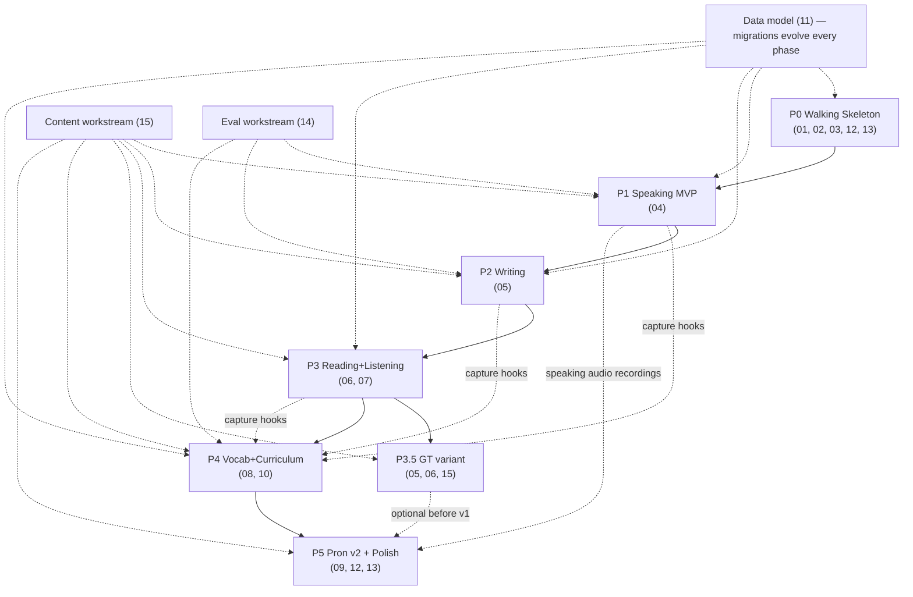

# 16 — Roadmap & phased build plan

> **Design intent as of 2026-07-25 — not a description of what exists.** This is a planning document, written before implementation began. Much of it shipped differently. For what actually ships, read [IMPLEMENTATION-STATUS.md](../IMPLEMENTATION-STATUS.md). Where this doc and the code disagree, the code is right.
>
> Kept because the reasoning behind each decision is not recorded anywhere else, and the `R2-*` rulings in [_context/decisions.md](_context/decisions.md) are cited from code comments.

_Status: draft v2 (2026-07-25)_

This doc sequences BandReady from empty repo to v1.0 public OSS launch as six phases (P0–P5), each with concrete scope, testable exit criteria, and effort in **focused solo-dev weeks** (one unit = ~30 productive hours; calendar time will be longer). The ordering principle: de-risk the scariest integration first (Electron + Python sidecar + Pipecat voice = P0), then ship the differentiating module first (Speaking = P1), then widen to the other skills, then bind everything with vocabulary/curriculum, then polish to launch quality. Three workstreams — content authoring (15-content-authoring-licensing.md), scoring-quality evals (14-testing-strategy.md), and docs — run continuously alongside the phases. Headline decisions made here: **ship Academic-first; General Training variants land in a small P3.5 sub-phase**, and pronunciation GOP scoring is deliberately deferred to P5 so it never blocks the core loop. Total estimate: **~31 solo-dev weeks** to v1.0 (plus P3.5's +1.5), i.e. roughly 9–11 calendar months at sustainable solo pace.

## 1. Planning principles

1. **Integration risk first.** Electron-spawns-sidecar, packaged Python runtime, and the five Pipecat gotchas (02-voice-pipeline.md) are the only "we don't know if this works" territory. Everything else is CRUD + prompts. So P0 is a thin vertical slice through all of it.
2. **Every phase ends with a demoable, packaged build.** "Works in dev" never counts as done; the exit criterion is always exercised on the *packaged* app on both macOS (Apple Silicon) and Windows.
3. **Each phase produces a tagged pre-release** (`v0.1.0` … `v0.6.0`) with release notes. This builds the changelog habit and gives early testers stable checkpoints.
4. **Content and eval work never blocks code phases.** They are parallel workstreams (§9) with their own deliverable counts pinned to phase exits.
5. **Cut scope, not quality gates.** When a phase overruns, features move to the next phase or post-v1; exit criteria and test gates do not soften. (Risk R4, §13.)
6. Effort numbers below are defaults chosen for planning, not promises — flagged per convention as defaults.

## 2. Phase overview

| Phase | Name | Scope headline | Effort (wks) | Cumulative | Tag |
|---|---|---|---|---|---|
| P0 | Walking Skeleton | Talk to an AI through the packaged app | 4 | 4 | v0.1.0 |
| P1 | Speaking MVP | Complete scored mock speaking test | 6 | 10 | v0.2.0 |
| P2 | Writing | Task 1 + Task 2 with annotated evaluation + rewrite loop | 5 | 15 | v0.3.0 |
| P3 | Reading + Listening | Full test players, band conversion, TTS-generated listening | 5 | 20 | v0.4.0 |
| P3.5 | General Training variant | GT Reading/Writing content + module switches | 1.5 | 21.5 | v0.4.5 |
| P4 | Vocabulary + Curriculum | FSRS engine, capture hooks, placement, study plan, dashboard | 5 | 26.5 | v0.5.0 |
| P5 | Pronunciation v2 + Polish | GOP pipeline, a11y, macOS signing/notarization, auto-update → **v1.0 launch** | 4.5 | 31 | v1.0.0 |

Default assumption: P3.5 runs immediately after P3 (content is fresh in mind) but is the designated slip-buffer — if the schedule is red, it slides to post-v1 and v1.0 ships Academic-only (see decision D1 in §13).

## 3. P0 — Walking Skeleton (4 wks)

The thinnest possible line through every layer: repo, Electron shell, sidecar spawn, settings, live voice, packaging. Nothing IELTS-specific yet.

### Scope

- **Repo scaffold** exactly per 01-architecture.md §7, whose layout is **binding** (R2-9): pnpm workspace (single package manager, per openvoiceui-findings §6), `app/` (one package: `app/electron/` Electron main + preload; React 18 + Vite + TS + Tailwind renderer with features under `app/src/features/<module>/`), `sidecar/bandready/` (FastAPI, SQLAlchemy 2.0 + Alembic, pipecat-ai **pinned 1.5.0**), `content/` (empty pack structure), `docs/`. CI: GitHub Actions matrix (macos-14, windows-2022) running lint + typecheck + pytest + vitest on every PR.
- **Electron ⇄ sidecar lifecycle**: main process generates random port + bearer token, spawns sidecar with `BANDREADY_PORT`/`BANDREADY_AUTH_TOKEN` env, polls `GET /health` until ready — the window is shown only once healthy, so no splash/loading screen exists (01 §4.2, R2-12) — kills child on quit, restarts on crash (fatal after 5 consecutive failures, then error dialog — 01 §4.4, R2-12). Preload bridge exposes `getSidecarInfo()` only.
- **Design-system port**: copy the 19-token HSL palette, Inter Variable, Tailwind config, and the core UI kit (Button, Card, Input, Select, Modal, Field, Spinner) from OpenVoiceUI per 12-design-system.md. Dark default.
- **Settings page (one-of-each)**: exactly one LLM + one STT + one TTS config + VAD tunables, rendered from adapter `config_spec` (03-providers-and-settings.md), each with a **Verify** button (`verify()` → `{base_url}/models` for OpenAI-compatible; local adapters return ok immediately). Lockfile with atomic writes + env interpolation, radically simplified from OpenVoiceUI's lockfile v2. Engine auto-detect (mlx-lm / Ollama / Kokoro model files present) with guided-setup links; full guided installer UX is P5 polish.
- **Voice hello-world**: `POST /api/v1/speaking/sessions/{session_id}/offer` + trickle-ICE PATCH to the same URL (route per 18-api-contract.md; the earlier `/voice/offer` sketch is superseded — R2-1), pipeline assembled exactly per 02-voice-pipeline.md honoring all five gotchas (explicit `VADProcessor` after `transport.input()`; `SpeechTimeoutUserTurnStopStrategy(0.6)`; renderer calls `client.initDevices()` **before** `client.connect()`; PATCH to same `/offer` URL; `min_volume=0.0`, clamp user values ≤ 0.6). Greeting via `TTSSpeakFrame` on connect; `TranscriptObserver` writing a session transcript row. A bare "Voice check" page: connect, converse, disconnect, see transcript.
- **SQLite bootstrap**: WAL + `foreign_keys=ON` + `busy_timeout=5000`, Alembic migration 0001 (`profiles`, `settings`, `practice_sessions`, `speaking_sessions`, `speaking_turns` — table names per 11-data-model.md, canonical), per-install secret at data dir (0600), API keys encrypted at rest.
- **Packaged dev build**: electron-builder producing unsigned `.dmg` (arm64) and `.exe` (x64) with bundled Python runtime per 13-packaging-distribution.md (python-build-standalone default; PyInstaller fallback spike if size/AV problems). SPA dist force-included; sidecar path computed from `Path(__file__).parent` (never source-tree-relative — the OpenVoiceUI wheel gotcha).

### Exit criteria (all on the *packaged* build, macOS + Windows)

- [ ] App launches, sidecar spawns, `/health` green within 10 s cold start.
- [ ] Configure an LLM (one local: mlx-lm or Ollama; one cloud: OpenRouter), STT (whisper local), TTS (Kokoro ONNX); all three Verify buttons pass.
- [ ] Hold a ≥ 6-turn spoken conversation with the AI; interruption works; transcript persisted and visible after hangup.
- [ ] Quit → sidecar process is gone (no orphans, verified in Activity Monitor / Task Manager).
- [ ] Kill sidecar manually → app shows recovery UI and restarts it.
- [ ] CI green on both OS runners; packaged-build smoke script (headless health + `/offer` handshake) passes in CI.

## 4. P1 — Speaking MVP (6 wks)

The differentiator. Ship a complete, scored IELTS-style speaking mock. Spec: 04-speaking-module.md.

### Scope

- **Part 1/2/3 state machine** in the sidecar (canonical state names per 04 §3.1 — R2-11): intro → Part 1 (4–5 questions) → Part 2 (cue card: 60 s prep with visible card + timer, 1–2 min long turn, auto-advance) → Part 3 (discussion) → wrap-up. Question cards injected into the live session via the RAG-processor pattern (single marked system message before last user turn, previous one stripped — openvoiceui-findings §7) so rubric/question context never accumulates.
- **Personas** as composable prompt fragments (skills pattern): exactly **one examiner persona + one coach persona** (04 §4; the earlier neutral/encouraging/strict trio is repealed — R2-12); merged with part-specific behavior fragments (verbatim templates live in 04-speaking-module.md).
- **Transcript + timing capture**: extend `TranscriptObserver` with per-turn `t_start_ms`/`t_end_ms`, part boundaries, prep-time and long-turn durations, filled-pause heuristics from STT output. This is the scoring input and the raw material for 09-pronunciation-assessment.md later.
- **LLM evaluation report**: post-session scoring call(s) against the four public speaking criteria (Fluency & Coherence, Lexical Resource, Grammatical Range & Accuracy, Pronunciation-proxy from transcript evidence only, clearly labeled as transcript-based until P5). Output: per-criterion band + evidence quotes + 3 prioritized improvement actions + estimated overall band, recomputed **server-side** from the criterion bands via the shared `round_ielts()` (ties round up; the model's own overall value is ignored — R2-4). Rendered report page with expandable evidence.
- **Session management**: start/resume-safe (a dropped call ends the attempt gracefully and still scores completed parts), history list, per-session detail page, retake.
- **Content**: **20 original topic sets** (each = Part 1 set + cue card + Part 3 set) from the content workstream (§9), stored in the content-pack format from 15-content-authoring-licensing.md.
- **Eval harness v1**: adapt OpenVoiceUI's headless voice E2E harness (TTS-synthesized caller via aiortc `MediaPlayer`, transcript polling) to drive a scripted mock candidate through a full Part 1; assert state-machine transitions and that a report is produced. First scoring-quality eval set: 10 transcripts with reference band ranges (§9.2).

### Exit criteria

- [ ] Full 11–14 min mock speaking test, all three parts, on the packaged build, with a local LLM and with a cloud LLM.
- [ ] Cue-card prep timer, monologue timer, and auto-advance behave per 04-speaking-module.md.
- [ ] Score report renders with per-criterion bands, quoted evidence, and actions; report persists in history.
- [ ] Dropped-connection mid-Part-2 → session closes cleanly, partial report generated, no zombie pipeline task.
- [ ] Headless E2E (Part 1 scripted candidate) green in CI on macOS runner.
- [ ] Scoring eval v1: on the 10-transcript set, ≥ 8/10 estimated overall bands within ±1.0 of reference range midpoint (default threshold; 14-testing-strategy.md owns the metric).

## 5. P2 — Writing (5 wks)

Spec: 05-writing-module.md.

### Scope

- **Editor**: distraction-free writing surface with word count, target-time countdown (20/40 min), paste **allowed but recorded** (paste-event count + integrity flag on the attempt, never a block — 05 §3, R2-12; the earlier paste-blocking toggle is repealed), autosave every 10 s to SQLite drafts (05 §3, R2-12).
- **Task 1 (Academic) chart renderer**: prompts stored as data specs (line/bar/pie/table/process/map per 05); charts rendered deterministically in the renderer (SVG) from the spec so authored content is text + JSON, never copyrighted images.
- **Task 2** essay flow with question-type tags (opinion / discussion / problem-solution / advantages-disadvantages / two-part).
- **Evaluation with annotations**: LLM scoring against the four writing criteria (TA/TR, CC, LR, GRA) returning a JSON report with **character-offset annotations** (issue span, category, severity, suggested fix) rendered as inline highlights + margin cards; per-criterion bands + overall recomputed server-side via the same shared `round_ielts()` (ties round up — 05's conservative rounding is repealed, R2-4).
- **Rewrite loop**: "Revise" creates a linked second attempt pre-loaded with the annotated original; diff view against previous attempt; report compares bands across attempts.
- **Content**: **40 original prompts** (default split: 20 Academic Task 1 with chart specs, 20 Task 2).
- Evals: writing scoring eval set v1 (15 essays with reference bands); annotation-offset validity test (every annotation span must exist in the submitted text — guards LLM hallucinated quotes).

### Exit criteria

- [ ] Write, submit, and receive an annotated Task 1 + Task 2 evaluation on the packaged build.
- [ ] All chart types render from spec JSON; no bitmap chart assets in the content pack.
- [ ] Rewrite loop: second attempt links to first, diff renders, band delta shown.
- [ ] Annotation validity test: 100% of annotation offsets resolve to real spans across the eval set.
- [ ] Writing eval v1: ≥ 11/15 overall bands within ±1.0 of reference (default threshold).

## 6. P3 — Reading + Listening (5 wks)

Specs: 06-reading-module.md, 07-listening-module.md. These two share a test-player core, so they ship together.

### Scope

- **Shared test player**: timed multi-section player, question-type renderers (MCQ, T/F/NG & Y/N/NG, matching headings/features/sentence-endings, sentence/summary/note/table/diagram completion, short answer), flag-for-review, answer sheet, section navigation.
- **Answer matching engine**: deterministic (no LLM), implemented **once** as the shared normalizer at `sidecar/bandready/scoring/answers.py`, imported by reading AND listening (R2-9): normalization (case, variant-aware article stripping — strip a leading article only if every stored variant lacks one (07's rule, per R2-9), hyphen/space equivalence, number words ↔ digits), word-limit enforcement ("NO MORE THAN TWO WORDS"), alternative-answer sets in the key format (06 owns the exact matcher spec + table-driven tests).
- **Band conversion tables**: raw-score → band for Academic Reading and Listening (published conversion ranges; stored as data).
- **TTS listening generation pipeline**: authored scripts (multi-speaker, per 07) → offline synthesis via Kokoro multi-voice → per-section audio assets baked into the content pack at authoring time (not at runtime), with distractor/correction moments scripted in. Section 1 dialogues use two distinct voices minimum.
- **Content validation pipeline** (CLI, runs in CI): schema-validate packs; assert every question has a key; audio duration within section bounds; answer-key words appear in transcript/passage; unique IDs. Ships as `bandready-content validate` (implemented in `tools/content/` inside the main repo; `bandready-content` is a thin PyPI re-export of `bandready.content` validators — R2-8, 15 documents the factoring).
- **Content**: **4 full Academic reading tests** (3 passages, 40 Qs each) + **2 full listening tests** (4 sections, 40 Qs each), all original.
- Review mode: per-question explanation (authored, with optional LLM elaboration), locate-answer-in-passage highlighting.

### Exit criteria

- [ ] Complete a timed full reading test and full listening test on the packaged build; raw score → band displayed.
- [ ] Matcher passes its table-driven suite (≥ 200 cases incl. tricky normalizations) with zero failures.
- [ ] `bandready-content validate` green on all shipped packs and wired into CI.
- [ ] Listening audio judged intelligible at test pace in a self-run listen-through of both tests (subjective gate; see risk R3).
- [ ] Review mode shows correct answer, explanation, and passage location for every question type.

### P3.5 — General Training variant (1.5 wks, slip-buffer)

**Decision (D1): ship Academic-first; GT is P3.5, and P3.5 is the first thing cut if the schedule slips** (moves post-v1, v1.0 ships Academic-only with GT flagged "coming"). Scope: GT Reading test structure (Sections 1–3, everyday/workplace texts — 2 full tests), GT Writing Task 1 letters (formal/semi-formal/informal — 10 prompts + letter-specific rubric fragment), GT band-conversion table, module toggle in test selection + curriculum. Speaking and Listening are identical across variants — no work. Exit: complete GT reading test + GT letter with evaluation on packaged build.

## 7. P4 — Vocabulary + Curriculum (5 wks)

Specs: 08-vocabulary-srs.md, 10-curriculum-progress.md. This phase turns four practice tools into one coherent product.

### Scope

- **FSRS engine** in the sidecar (fsrs algorithm per 08; default parameters, per-card state in SQLite), review scheduling, 4-grade rating.
- **Capture hooks in all modules**: Speaking report "words you reached for" + upgrade suggestions → add-to-deck; Writing annotations (LR category) → add-to-deck; Reading/Listening: tap-a-word in passage/transcript → dictionary card (offline bundled-WordNet definitions via `GET /api/v1/dictionary/{word}` — R2-20, 08 specs it) → add-to-deck. Every card stores its source context sentence.
- **Review UI**: daily queue, card front/back with context sentence, type-the-word and self-grade modes, streaks, per-deck stats.
- **Onboarding + placement**: first-run wizard owned end-to-end by 10-curriculum-progress.md (R2-14; 12 §6.9 and 13 §7.1's model-download step are steps within 10's wizard) → ~30 min placement (adaptive reading/listening samplers, short writing task, speaking sampler — the speaking sampler is skippable, and any skipped section falls back to the self-assessed level for that skill, R2-14) → estimated current band per skill.
- **Plan generator**: inputs = target band + exam date + placement result + weekly available hours; output = week-by-week plan (sessions per module, review load) stored as plan rows; plan re-computes on progress. Rule-based default (no LLM required for planning), LLM used only for the plan's narrative summary.
- **Dashboard**: band trajectory per skill (score history charts), streak, today's plan, weakest-criterion callouts sourced from report data.

### Exit criteria

- [ ] New-profile flow: onboarding → placement → generated plan → dashboard, end-to-end on packaged build.
- [ ] Words captured from each of the four modules appear in the review queue with source context.
- [ ] FSRS scheduling verified by simulated-clock unit tests (intervals match reference implementation vectors).
- [ ] Dashboard reflects a seeded 4-week history correctly (fixture profile).
- [ ] Plan adjusts when a week is missed (re-plan produces a valid, non-punitive schedule).

## 8. P5 — Pronunciation v2 + Polish → v1.0 (4.5 wks)

Specs: 09-pronunciation-assessment.md, 12-design-system.md, 13-packaging-distribution.md.

### Scope

- **GOP pipeline per 09**: forced alignment + goodness-of-pronunciation scoring on captured speaking audio; phoneme-level heatmap on the transcript; upgrades the speaking report's Pronunciation criterion from transcript-proxy to acoustic evidence (clearly versioned in the report).
- **Read-aloud drills**: sentence bank → record → per-phoneme feedback → retry; **minimal-pair drills** (listen-and-discriminate + produce) targeting the user's weak phonemes from GOP history.
- **Design polish pass**: full-app consistency sweep against 12-design-system.md, empty states, loading states, error states, reduced-motion support.
- **Accessibility audit**: keyboard navigation everywhere, focus management in modals/players, ARIA on custom widgets, contrast check on both themes, captions/transcript access for all audio. Target: WCAG 2.1 AA on core flows (default target).
- **Packaging hardening**: macOS notarized + Developer ID signing; **Windows ships unsigned in v1.0** with the documented SmartScreen install flow (13 §8.2 decides this; R2-12 — code signing, e.g. Azure Trusted Signing, is a post-v1 upgrade); auto-update via electron-updater + GitHub Releases channel; delta updates if size permits; install-size diet pass (prune torch/CUDA-adjacent wheels, ship Kokoro model as a first-run download — default decisions, 13 owns).
- **Launch prep** executed per §10.

### Exit criteria (= v1.0 gate)

- [ ] GOP feedback renders for a recorded Part 2 monologue; read-aloud and minimal-pair drills playable end-to-end.
- [ ] Signed + notarized macOS installer; Windows installer unsigned with the SmartScreen flow documented (README + in-app first-run note, per 13 §8.2 — R2-12); auto-update succeeds v0.6.0 → v1.0.0-rc on both OSes.
- [ ] Fresh-machine installs (macOS VM + Windows VM, no dev tools) reach a scored speaking session with only in-app guidance.
- [ ] Accessibility checklist pass on the six core flows; axe-core CI check green.
- [ ] All §10 launch-checklist items done.
- [ ] Install size ≤ 700 MB per platform installer (default budget; risk R2).

## 9. Cross-cutting workstreams (run through all phases)

### 9.1 Content authoring (per 15-content-authoring-licensing.md)

Original-only content in pack format; validation CLI from P3 applied retroactively to earlier packs. Cadence pinned to phase exits:

| Due at | Deliverable |
|---|---|
| P1 exit | 20 speaking topic sets |
| P2 exit | 40 writing prompts (incl. chart specs) |
| P3 exit | 4 reading + 2 listening tests (scripts + baked audio) |
| P3.5 exit | 2 GT reading tests + 10 GT letter prompts |
| P4 exit | **Placement pack** (R2-22): 2 same-family reading passage pairs (band 5–6 / band 7–8 versions), 2 listening samplers, 4 short writing tasks (2 per variant), 4 speaking Part 1 topic minis; seed vocabulary decks (Academic Word List-derived, checked for licensing per 15) |
| P5 exit | Read-aloud sentence bank + minimal-pair sets |

**This table IS the v1.0 content gate (R2-13):** the cumulative deliverables above — 20 speaking topic sets, 40 writing prompts, 4 reading + 2 listening tests (plus P3.5's 2 GT reading tests and 10 GT letters if it ships), the placement pack, seed vocabulary decks, and the P5 drill banks — are what v1.0 requires; nothing more. 15 §5's larger launch table is relabelled the **content roadmap through v1.x** and is NOT a v1.0 blocker; its second recruited reviewer is post-v1.0 unless recruited earlier (15's effort plan notes this).

Budgeted at ~15% of each phase's effort (already inside the phase numbers). LLM-drafted, human-edited, always validated — never shipped raw (risk R6).

### 9.2 Scoring-quality evals (per 14-testing-strategy.md) — starts in P1

A versioned eval corpus (transcripts/essays with reference band ranges) + a `bandready-eval` CLI that runs the scoring prompts against a matrix of models and reports band-error distributions. Grows each phase (10 speaking → +15 writing → +placement). Run: on every scoring-prompt change, and monthly against the recommended-models list. Publishing these numbers is part of the launch trust story (risk R1).

### 9.3 Docs & community

README kept truthful per phase; CONTRIBUTING.md + content-authoring guide by P3 (content is the easiest external contribution); architecture docs = these plan files, promoted to `docs/` as they stabilize; demo GIF refreshed each tagged pre-release.

## 10. Dependency graph & launch plan

Notes: P2 and P3 are technically parallelizable, but solo-dev context-switching cost says serialize (default). P4 hard-depends on P1–P3 because placement and capture hooks need all modules. P5's GOP work depends only on P1's audio capture — it could start earlier if P2–P4 stall, which is the designated re-ordering escape hatch.

### Launch plan (v1.0, executed during P5)

Pre-launch checklist:

- [ ] README: 90-second demo video (full speaking mock → report), feature matrix, install one-liners, honest "what the scores mean" section linking eval numbers.
- [ ] Landing page (static, GitHub Pages default): screenshots, download buttons, privacy pitch ("your mic audio never leaves your machine unless *you* point it at a cloud key").
- [ ] Installers on GitHub Releases: signed + notarized macOS arm64; unsigned Windows x64 with the documented SmartScreen flow (13 §8.2); Linux AppImage best-effort.
- [ ] CONTRIBUTING.md + content-pack authoring guide + `bandready-content validate` documented.
- [ ] 10–15 curated good-first-issues (content packs, matcher edge cases, translations of UI copy, additional TTS voices).
- [ ] Trademark hygiene review: product name/branding contains no "IELTS"; every "IELTS-style" mention framed as compatible-format practice; no past-paper content anywhere (per 15 and decisions.md).
- [ ] Scoring-eval report published in repo (§9.2).
- [ ] Security notes: loopback-only sidecar, bearer token, keys encrypted at rest (from 01).

Launch sequence (default): tag v1.0.0 → Show HN post (angle: "open-source, self-hosted IELTS-style prep with your own AI models — first complete OSS package") → same week: r/IELTS (practice-value angle, mod rules permitting), r/selfhosted (local-first angle), r/LocalLLaMA (local-model angle) → follow-up blog post on the five Pipecat gotchas as engineering-audience flywheel.

## 11. Post-v1 candidate directions (not commitments)

1. **Exam packs — the architecture hook to keep NOW.** TOEFL/PTE/CEFR share the shape: section structure + question types + rubric + band/score mapping + personas. From P1 onward, keep exam-specific facts (part definitions, criteria names, band tables, prompt fragments) in the content/config layer, never hard-coded in module code, so a future `exam_pack` is data + prompt fragments + optional custom question-type renderers. Cheap now, prohibitive to retrofit.
2. **Separate evaluator-model slot**: score with a stronger/cheaper model than the live examiner (e.g. local live examiner + cloud evaluator). The scoring orchestrator should already take a model handle as a parameter (P1) so this is later just settings UI.
3. **Mobile companion**: read-only progress + vocabulary review on phone (SRS is the natural mobile surface). Implies an optional sync story — explicitly out of v1's local-first scope.
4. **Tutor/classroom mode**: a teacher reviews learner reports, assigns content. This is where OpenVoiceUI's multi-user/RBAC DNA becomes relevant again; possible open-core seam.
5. Additional local engines (parakeet STT, higher-quality local TTS for listening realism), band-9 model answers library, interview-style Part 3 difficulty adaptation.

## 12. Top 10 risks & mitigations

| # | Risk | Impact | Mitigation |
|---|---|---|---|
| R1 | **Scoring accuracy trust** — users compare app bands to real results; misses destroy credibility | Product-killing | Eval corpus from P1 with published error distributions; report bands as ranges (e.g. "6.0–6.5") with evidence quotes; label transcript-proxy pronunciation until P5; recommended-models list gated by eval performance; never claim official equivalence |
| R2 | **Install size** — Electron + Python + models balloons past user patience | High churn at install | 700 MB installer budget (P5 gate); first-run model downloads (Kokoro, whisper) instead of bundling; dependency diet in CI (size check per PR from P0); document sizes honestly |
| R3 | **TTS listening realism** — synthetic voices too clean/robotic vs. real test accents & pace | Weakens a whole module | Multi-voice scripted synthesis with scripted disfluencies/corrections (P3); self-run listen-through gate; label as "practice-grade audio" in v1; post-v1: premium local TTS engines, community-recorded audio packs |
| R4 | **Solo-dev scope creep** — six modules + content + evals is a lot for one person | Never ships | Phase gates with packaged-build exit criteria; P3.5 as designated cut (D1); pronunciation GOP deferred to P5 by design; "cut scope not gates" rule (§1.5); public tagged pre-releases create cadence pressure |
| R5 | **Pipecat/regression risk** — pinned 1.5.0; upgrades can silently reintroduce the five gotchas | Voice breaks late | Version pinned in decisions.md; headless E2E harness in CI from P1 exercises VAD/turn-taking end-to-end; upgrade only in a dedicated spike with the harness as the gate |
| R6 | **Content quality/licensing** — LLM-drafted content that's wrong, off-format, or accidentally plagiarized | Legal + credibility | Original-only rule (15); human edit pass on all content; validation CLI in CI (P3); plagiarism spot-checks on drafted passages; no past-paper text ever enters the repo |
| R7 | **Packaged-Python fragility** — AV false positives (Windows), notarization, native wheels (aiortc, onnxruntime) breaking in frozen builds | Blocks releases | P0 proves packaging on both OSes before any feature work; macOS signing + notarization rehearsed in P5 with time reserved (Windows unsigned in v1 per 13 §8.2); PyInstaller ↔ python-build-standalone fallback kept alive; CI builds installers on every main merge |
| R8 | **Local-model quality variance** — a 7B local LLM examines/scores noticeably worse than cloud models | Bad first impression for local-first users | Per-task minimum-model guidance in settings (from eval data); graceful degradation copy; evaluator-slot architecture (§11.2) enables "local live, cloud score" |
| R9 | **Trademark exposure** — "IELTS" is a British Council/IDP/Cambridge mark | Rename/takedown | Name contains no mark (decisions.md); "IELTS-style" descriptive-use framing reviewed at launch checklist; band descriptors used as published facts, never copied rubric text verbatim where copyrighted (15 owns) |
| R10 | **WebRTC-on-loopback edge cases** — device/OS-specific mic permission, virtual audio devices, corporate AV interfering with UDP | Support burden | `describeError()`-style mic-permission UX from P0; in-app mic test on the settings page; loopback-only ICE (empty ICE servers) keeps surface small; troubleshooting doc seeded from beta reports |

**Decision D1 (restated): Academic-first.** GT differs only in Reading and Writing Task 1; it lands as P3.5 (+1.5 wks) and is the first scope cut if v1 timing is at risk. Rationale: Academic is the larger candidate pool for the app's likely early adopters (university/immigration-skilled routes), and cutting GT loses two content sets, not architecture.

## Open questions

1. **P3.5 in or out of v1?** Deliberately deferred until the P3 exit review — decided by actual schedule health, not now.
2. **Beta program timing**: invite external testers at v0.2.0 (speaking works, maximum feedback) or v0.4.0 (fewer embarrassing gaps)? Leaning v0.2.0 with a "pre-alpha" label, but the support burden on a solo dev is a real cost.
3. **Eval reference bands provenance**: reference band ranges in the eval corpus are self-assessed against public descriptors; is it worth paying certified IELTS tutors to rate a subset (~$500–1000) before launch to strengthen R1? Likely yes, unbudgeted.
