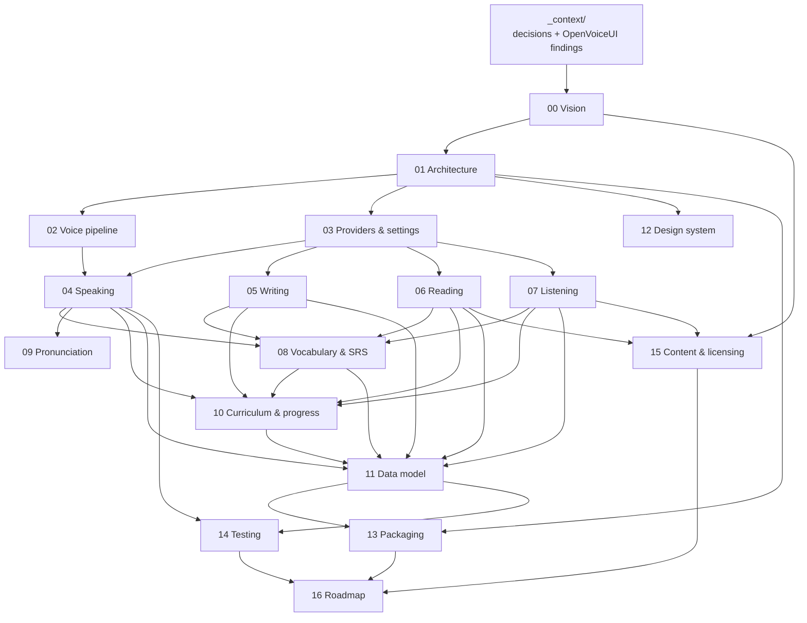

# BandReady — Planning Docs Index

> **These are design documents, not status. The app is built.** Everything in this directory
> was written on 2026-07-25, before implementation began. BandReady now runs end to end,
> packages into a macOS DMG, and passes roughly 1,800 tests. Much of the plan shipped
> differently, and several docs describe things that were never built or were built another way.
>
> **If you want to know what exists, do not read this directory.** Read
> [IMPLEMENTATION-STATUS.md](../IMPLEMENTATION-STATUS.md) for what is built,
> [REPOSITORY.md](../REPOSITORY.md) for how the tree is laid out, and
> [CONTRIBUTING.md](../../CONTRIBUTING.md) for how to change it. Where a plan doc and the code
> disagree, **the code is right**.
>
> These docs are kept, not archived, because the *reasoning* behind each decision is recorded
> nowhere else, and because two pieces of them are still binding law rather than intent:
> **`09 §0`** (pronunciation measures intelligibility, never accent proximity) and the
> **`R2-*` rulings** in [_context/decisions.md](_context/decisions.md), which are cited by name
> from code comments. Every numbered doc carries this warning in its own header.

_Status when written: planning complete (2026-07-25) — pre-implementation. Docs are at **v2**
after the round-2 reconciliation pass (rulings R2-1..R2-24 in `_context/decisions.md`;
resolution log in `17-review-findings.md`)._

## What is BandReady?

BandReady is an open-source, self-hosted desktop app for complete IELTS-style exam preparation: all four skills (Speaking, Writing, Reading, Listening) plus a spaced-repetition vocabulary bank, pronunciation feedback, and a guided curriculum from placement test to exam-ready. Its wedge is a live AI voice examiner — a real-time spoken mock interview powered by a proven Pipecat pipeline — something no other open-source project ships. Everything is local-first and bring-your-own-model: one learner, no accounts, no telemetry, with any OpenAI-compatible endpoint (local MLX/Ollama or cloud keys) driving the AI.

## Locked stack

| Layer | Decision |
|---|---|
| Shell | Electron + React 18 + Vite + TypeScript + Tailwind (ADR-001 — not React Native) |
| Backend | Python FastAPI sidecar spawned by Electron main — loopback-only, random port, token-authenticated (ADR-002) |
| Voice | pipecat-ai pinned 1.5.0, SmallWebRTCTransport, Silero VAD (the five OpenVoiceUI gotchas are law) |
| Data | SQLite (WAL, foreign_keys ON) via SQLAlchemy 2.0 + Alembic, per-OS app data dir |
| Providers | Exactly one LLM + one STT + one TTS, all OpenAI-compatible or in-process; local defaults: MLX (mac), Ollama + faster-whisper (win/linux), Kokoro ONNX TTS everywhere |
| License | Apache-2.0 app; CC0-1.0 first-party content; separate project from OpenVoiceUI |

## Recommended reading order

Read top to bottom; each doc cross-references siblings by filename.

### Context (read first)

| Doc | One-liner |
|---|---|
| [_context/decisions.md](_context/decisions.md) | The locked planning decisions every doc must align with — product, stack ADR summaries, conventions. |
| [_context/openvoiceui-findings.md](_context/openvoiceui-findings.md) | Hard-won OpenVoiceUI knowledge reused here, including the five Pipecat voice-pipeline gotchas. |

### Foundation

| Doc | One-liner |
|---|---|
| [00-vision.md](00-vision.md) | Product vision, personas, verified competitive survey, first-mover positioning, principles, metrics, naming, and strict v1 scope. |
| [01-architecture.md](01-architecture.md) | Three-process architecture (Electron main / React renderer / Python sidecar), ADR-001/002 in full, sidecar spawn contract, security model, repo tree. |
| [02-voice-pipeline.md](02-voice-pipeline.md) | Exact Pipecat 1.5.0 processor chain for speaking sessions, question-card injection, timed transcripts and fluency metrics, per-turn recording, <1.5s latency budget. |
| [03-providers-and-settings.md](03-providers-and-settings.md) | The one-LLM/one-STT/one-TTS settings model: settings.json schema, atomic writes, engine auto-detection, presets, Verify semantics, hardware-tier recommendations. |

### Skill modules

| Doc | One-liner |
|---|---|
| [04-speaking-module.md](04-speaking-module.md) | Faithful 3-part speaking test: session modes, state machine, examiner prompts, band descriptors, evaluation prompt, feedback UX, DDL and API. |
| [05-writing-module.md](05-writing-module.md) | All three writing task types: SVG chart specs, exam/practice editor, single-call evaluation, inline annotations, rewrite-diff-rescore loop, model answers. |
| [06-reading-module.md](06-reading-module.md) | All 14 question types, passage+question schema, deterministic offline scoring with band tables, CD-IELTS-style player, LLM generation pipeline with blind validation. |
| [07-listening-module.md](07-listening-module.md) | 4-part listening tests built entirely from TTS: script schema, Kokoro multi-voice render pipeline, accent map, strict scoring, dictation mini-mode. |

### Cross-skill systems

| Doc | One-liner |
|---|---|
| [08-vocabulary-srs.md](08-vocabulary-srs.md) | Dynamic vocab bank fed by all four skills, FSRS scheduling via py-fsrs, six exercise types, ~2,000-entry launch content, daily flow. |
| [09-pronunciation-assessment.md](09-pronunciation-assessment.md) | Phased pronunciation feedback: v1 whisper-confidence + LLM proxies with no new models, v2 fully local GOP pipeline; intelligibility-not-accent policy. |
| [10-curriculum-progress.md](10-curriculum-progress.md) | Onboarding wizard, placement test, deterministic study-plan generator, band estimator with confidence gating, adaptive-rules engine, dashboard. |

### Platform

| Doc | One-liner |
|---|---|
| [11-data-model.md](11-data-model.md) | Canonical SQLite schema across eight domains, media-cache layout and eviction, .brpack import/export, Alembic migration strategy — reconciles all module DDL sketches. |
| [12-design-system.md](12-design-system.md) | Full UI/UX system: HSL tokens (teal primary), typography, Electron chrome, 9 screen wireframes, component inventory, band-score color scale, accessibility. |
| [18-api-contract.md](18-api-contract.md) | The single authoritative sidecar HTTP/WebSocket contract: `/api/v1` route inventory, signed-ticket media/WS auth, the one-shot job convention — module docs reference this instead of inventing routes. |

### Delivery

| Doc | One-liner |
|---|---|
| [13-packaging-distribution.md](13-packaging-distribution.md) | Installers via electron-builder, python-build-standalone sidecar packaging (~0.9 GB total), on-demand model downloads, signing/notarization, auto-update. |
| [14-testing-strategy.md](14-testing-strategy.md) | Full test pyramid: table-driven matchers, headless voice E2E, the golden-set scoring-quality eval framework with accuracy gates, Playwright-on-Electron, CI matrix. |
| [15-content-authoring-licensing.md](15-content-authoring-licensing.md) | IELTS trademark fair use, copyright policy, CC0 content, generation-and-validation pipeline with human review, launch content targets, pack format. |
| [16-roadmap.md](16-roadmap.md) | Six phases from empty repo to v1.0 (~31 solo-dev weeks), cross-cutting workstreams, dependency graph, OSS launch checklist, risk register. |
| [17-review-findings.md](17-review-findings.md) | The round-2 cross-doc review: every conflict found between the docs above and how each was resolved. Read it when two docs disagree and you need to know which ruling settled it. |

## How these docs relate

## Conventions

- One topic per numbered file; each doc opens with title, `Status: draft (2026-07-25)`, and a one-paragraph summary, and ends with an **Open questions** section.
- Docs are concrete: real DDL, verbatim prompt templates, real JSON shapes, real file trees. Defaults are chosen and flagged, never left as "TBD".
- Cross-reference sibling docs by filename (e.g. "see 11-data-model.md").
